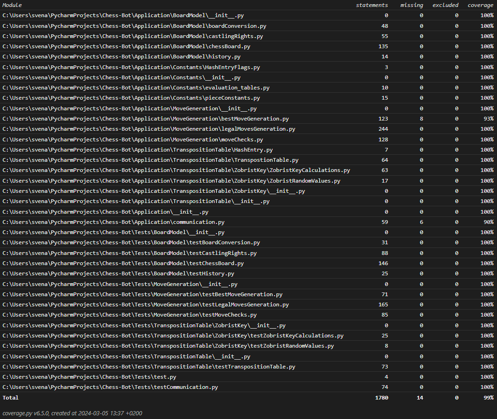

# Testing Documentation

## Unit Testing
The unit testing in this project is done by using the normal unittest framework.

The tests can be run using running the [test.py](/Tests/test.py) file normally.
The coverage report can be attained by running the file with coverage

## Current Code Coverage
The curerent code coverage is 99%. The only parts missing is the
quit() command in the [communication.py](/Application/communication.py) and the [`main()`](/Application/main.py).
The reasons for that is, that [`quit()`]((/Application/communication.py)) executes `sys.exit()` which
I couldnt properly test. [main()](/Application/main.py) only executes [talk()](/Application/main.py) which is the
main loop in communication.py. This is already tested.

In addition to that I did a lot of test runs of the engine playing against itself as
a 100% line coverage doesnt mean that there are no bugs in a complex application.

## Performance Testing
I let the AI play against itself a lot of times. As a human it is hard to
calculate how good the engine really is or why certain moves are done.
The Arena GUI which I used for letting the AI play against itself calculates on average
a ELO of 1800-2200 for the chess engine.

Even tho this is a nice result from the moves Ive seen I would say that the engine
is worse than that. Probaply around 1400 ELO